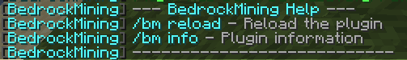

# BedrockMining

[RU](README_RU.md) | EN

BedrockMining is a flexible Minecraft plugin that allows players to mine bedrock blocks with configurable settings and visual feedback.



## Features

- **Configurable Mining Time**: Set custom mining duration for bedrock blocks
- **Tool Support**:
  - Different mining speed modifiers for various tools
  - Support for Diamond and Netherite pickaxes
  - Required Efficiency enchantment level setting
- **Visual Feedback**:
  - Multiple progress display modes (ActionBar, BossBar, Chat, Particles)
  - Customizable progress bar appearance
  - Optional particle effects during mining
- **Sound Effects**:
  - Configurable breaking and completion sounds
  - Adjustable volume and pitch settings
  - Customizable sound frequency
- **Drop Settings**:
  - Configure whether bedrock drops as an item
- **Multi-language Support**:
  - English and Russian languages
- **Version Compatibility**:
  - Works with multiple Minecraft versions (1.8.8+)
  - Automatic version detection
  - Version-specific adapters

## Requirements

- Java 8 or higher
- Spigot/Bukkit server (1.8.8 or higher)

## Installation

1. Download the latest `BedrockMining-1.0.0.jar` from the releases section
2. Place the JAR file in your server's `plugins` folder
3. Restart your server
4. A default configuration file will be generated at `plugins/BedrockMining/config.yml`

## Usage

Basic commands:

- `/bedrockmining` or `/bm` - Show plugin information
- `/bedrockmining help` - Display help information
- `/bedrockmining reload` - Reload the plugin configuration
- `/bedrockmining info` - Show plugin status and settings

## Permissions

- `bedrockmining.break` - Allows breaking bedrock (default: op)
- `bedrockmining.reload` - Allows reloading the plugin (default: op)
- `bedrockmining.admin` - Gives access to all commands (default: op)

## Building from Source

This project uses Maven as its build system. To build the plugin:

1. Clone the repository
2. Navigate to the project directory
3. Run:

```bash
mvn -B package --file pom.xml
```

The compiled JAR will be in `target/BedrockMining-1.0.0.jar`

## Dependencies

- Spigot API
