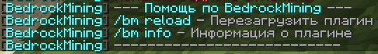

# BedrockMining

[EN](README.md) | RU

BedrockMining - плагин для Minecraft, который позволяет игрокам ломать блоки бедрока при выполнении определенных условий.



## Особенности

- **Настраиваемое время ломания**: Установка пользовательской продолжительности добычи бедрока
- **Поддержка инструментов**:
  - Различные модификаторы скорости для разных инструментов
  - Поддержка алмазных и незеритовых кирок
  - Настройка требуемого уровня зачарования Эффективность
- **Визуальная обратная связь**:
  - Несколько режимов отображения прогресса (ActionBar, BossBar, Чат, Частицы)
  - Настраиваемый внешний вид индикатора прогресса
  - Опциональные эффекты частиц при добыче
- **Звуковые эффекты**:
  - Настраиваемые звуки ломания и завершения
  - Регулируемые настройки громкости и тона
  - Настраиваемая частота звуков
- **Настройки выпадения**:
  - Настройка выпадения бедрока как предмета
- **Поддержка нескольких языков**:
  - Английский и русский языки
- **Совместимость версий**:
  - Работает с несколькими версиями Minecraft (1.8.8+)
  - Автоматическое определение версии
  - Специальные адаптеры для разных версий

## Требования

- Java 8 или выше
- Spigot/Bukkit сервер (1.8.8 или выше)

## Установка

1. Скачайте последнюю версию `BedrockMining-1.0.0.jar` из раздела релизов
2. Поместите JAR-файл в папку `plugins` вашего сервера
3. Перезапустите сервер
4. Файл конфигурации будет создан в `plugins/BedrockMining/config.yml`

## Использование

Основные команды:

- `/bedrockmining` или `/bm` - Показать информацию о плагине
- `/bedrockmining help` - Показать справочную информацию
- `/bedrockmining reload` - Перезагрузить конфигурацию плагина
- `/bedrockmining info` - Показать статус и настройки плагина

## Права доступа

- `bedrockmining.break` - Разрешает ломать бедрок (по умолчанию: op)
- `bedrockmining.reload` - Разрешает перезагружать плагин (по умолчанию: op)
- `bedrockmining.admin` - Дает доступ ко всем командам (по умолчанию: op)

## Сборка из исходного кода

Этот проект использует Maven в качестве системы сборки. Для сборки плагина:

1. Клонируйте репозиторий
2. Перейдите в директорию проекта
3. Выполните:

```bash
mvn -B package --file pom.xml
```

Скомпилированный JAR будет находиться в `target/BedrockMining-1.0.0.jar`

## Зависимости

- Spigot API
